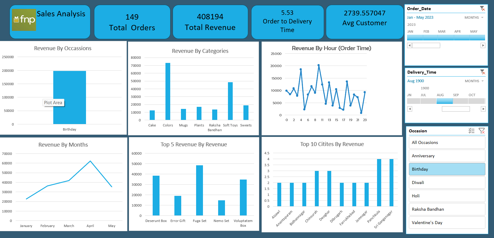

# Fnp_analysis-
Analysing data using Excel and creating a dashboard 
# 📊 Sales Analysis Dashboard

## 📌 Overview
This project is an interactive **Sales Analysis Dashboard** built using Power BI. It provides insights into sales performance across different dimensions such as occasions, categories, time, and locations.

The dashboard helps in understanding trends, identifying top-performing products, and making data-driven decisions.

---

## 🚀 Key Metrics

- 📦 Total Orders: 149  
- 💰 Total Revenue: 408,194  
- ⏱ Avg Order to Delivery Time: 5.53 days  
- 👥 Avg Customer Value: 2739.56  

---

## 📈 Dashboard Insights

### 🎉 Revenue by Occasion
- Highest revenue comes from **Birthday** occasions.

### 🛍 Revenue by Category
- Top categories:
  - Colors
  - Soft Toys
  - Sweets

### ⏰ Revenue by Order Time
- Sales vary throughout the day.
- Peak hours can be identified for better targeting.

### 📅 Revenue by Month
- Revenue peaks in **April** indicating seasonal demand.

### 🏆 Top 5 Products
- Fuga Set  
- Deserunt Box  
- Voluptatem Box  
- Error Gift  
- Nemo Set  

### 🌍 Top Cities by Revenue
- Panchkula  
- Sri Ganganagar  
- Deogarh  

---

## 🎛 Filters Available
- Order Date  
- Delivery Time  
- Occasion  

---

## 🛠 Tools & Technologies
 
- DAX  
- Excel / CSV  

---

## 📷 Dashboard Preview

